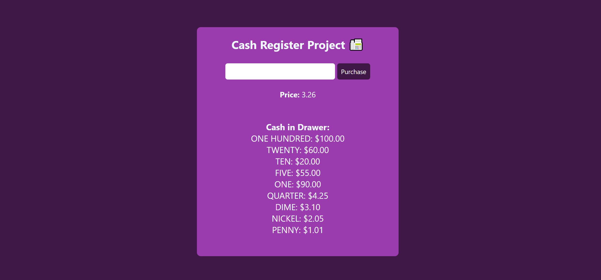

#  Cash_Register_App🚀

## Project Description 📝

>
This project is a cash register application that calculates and displays change due to a customer based on the price of an item, the cash provided, and the cash in the register drawer. It provides different messages depending on the scenario, such as when exact change is provided, when the cash provided is insufficient, or when the register drawer cannot provide exact change.
that have this functionalities:

Input: Enter the amount of cash provided by the customer in the input field labeled "Enter Cash Provided".
Click: Click on the "Purchase" button to calculate the change due.
Output: The app will display messages in the #change-due element based on the calculated change or scenario.
Credits of This project is based on the FreeCodeCamp Cash Register project and serves as a simplified implementation.
 
>


## Demo 📸

life demo link [(https://farwamuhibzada.github.io/Cash_Register_App/)]





## Technologies Used 🛠️

List the technologies or tools that i used to develop this project. 
- HTML
- CSS
- java script


## Installation 💻

for using this project you neet to install 3 things:

- chrombrowser
- an IDE like vscode
- git
- node JS


## Usage 🎯

for using this project you need to know a few commond first clone the repositry in yor local machine then go to the github directory . open the project on your IDE like vscode and start working on it .


go to the cmd and clone the Technical Documentation Page 
using this commond:
```bash

git clone https://github.com/FarwaMuhibZada/Cash_Register_App/.git 
```
go to the githu directory:
```bash

cd>Cash_Register_App

```
open the project on your IDE like vscode :

```bash

cd> code .

```


## Features ⭐
- take an inpute from user
- check the entered number
- has multipal conditions
- convert any number into Roman number
- give an output as result 
- return a alert box if there is an empty value 


## FarwaMuhibzada 👩‍💻


- LinkedIn: [(https://www.linkedin.com/in/farwa-muhibzada/)]
- Email: [(farwafarid2017@gmail.com)]

## Contributing 🤝
For contribution you can create a pull request and mention me there.Thank you.